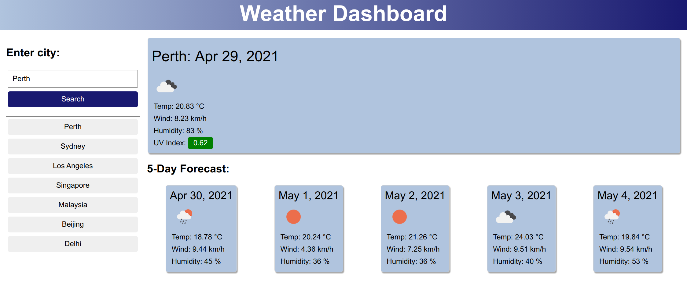

# Weather Dashboard
## Description
This repository contains a dynamically updated weather dashboard.

It uses the *OpenWeather* One Call API to retrieve weather data for cities.

It uses *LocalStorage* to store the user's search history.

The UI is clean, polished and responsive to multiple screen sizes.

When the user searches for a city, the current and future conditions are displayed and the city is added to the search history.
The current conditions section displays the city name, date, weather icon, temperature, humidity, wind speed and UV index (which is color coded according to severity).
The 5 day forecast displays the date, weather icon, temperature, wind speed and humidity.
The user can click on an item in the search history to be again presented with the current and future conditions for that city.
 

## Usage
The deployed website can be viewed here: https://dandycodes.github.io/weather-dashboard/
## Credits
https://developer.mozilla.org/en-US/

https://www.w3schools.com/
## License
Copyright (c) DandyCodes. All rights reserved.

Licensed under the [MIT](LICENSE.txt) license.